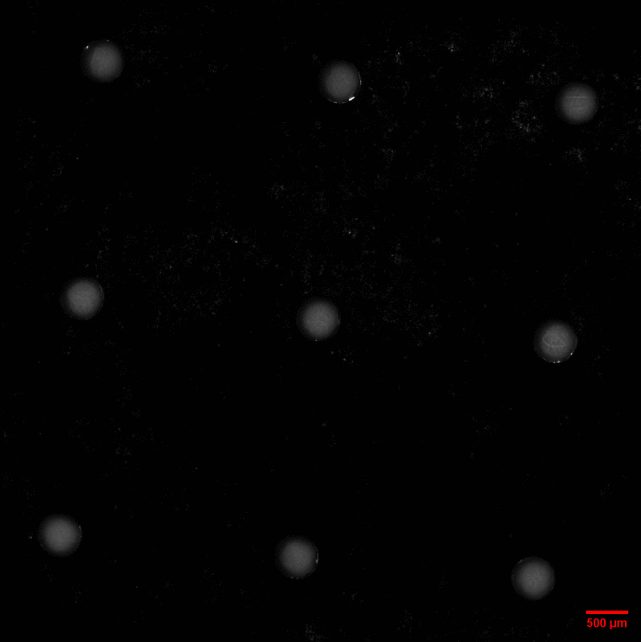
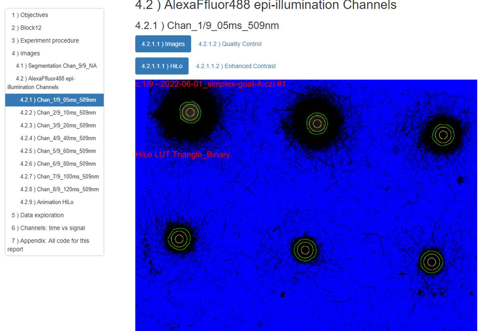

This page acts as a CV extension as well as a version control tool for my dry work.

# ${\color{red}{Ab}}$out me

Hi, I'm @AntoineC1990 a **wet-lab molecular biologist**.\
My job is to translate fundamental or practical questions into life science experimental setup.\
**Post-transcriptionnal regulations** (RNA & DNA manipulations) and **immunology** (antibody manipulations) are my main specialties.\

If you're interested in my work, You can reach me on [linkedin](https://www.linkedin.com/in/antoine-creugny-13851684).\

# ${\color{red}{My}}$ work

My main dry project consists of extracting numerical values of pixel intensity within region of interest (ROI) embedded in fluorescence microscopy stacked images. Each stack is composed of 8 channels of fluorescent signals captured with increasing acquisition time (epi-illumination), follow by a single white light (transmitted-illumination) channel.

First (Part I) numeric values are extracted from Stack images using [FiJi image manipulation](https://github.com/AntoineC1990/FiJi_.czi_9channels_segmentationTL).\
Then (Part II), both images and numeric values are merged to generate an dynamic HTML report using [Rmarkdown](https://github.com/AntoineC1990/Version_Rmarkdown-results).\

### Analyzing fluorescence microscopy images (FiJi)

You can find ijm macro, a readme and result example [here](https://github.com/AntoineC1990/FiJi_.czi_9channels_segmentationTL).\
The animation below represents the main function of the ijm macro. Quickly: White light channel segmentation, ROI generation, numeric extraction on all signal channels successively.

### Dynamic report (Rmarkdown)

You can find Export_Rmarkdown.Rmd, a readme and a html result example [here](https://github.com/AntoineC1990/Version_Rmarkdown-results).\
The animation below represents few part of the html report. Quickly: Channel images, ROI quality controls, dynamic plots for all channels, acquisition time-dependent signal controls.

{width=50%}

<!---
AntoineC1990/AntoineC1990 is a ✨ special ✨ repository because its `README.md` (this file) appears on your GitHub profile.
You can click the Preview link to take a look at your changes.
--->
